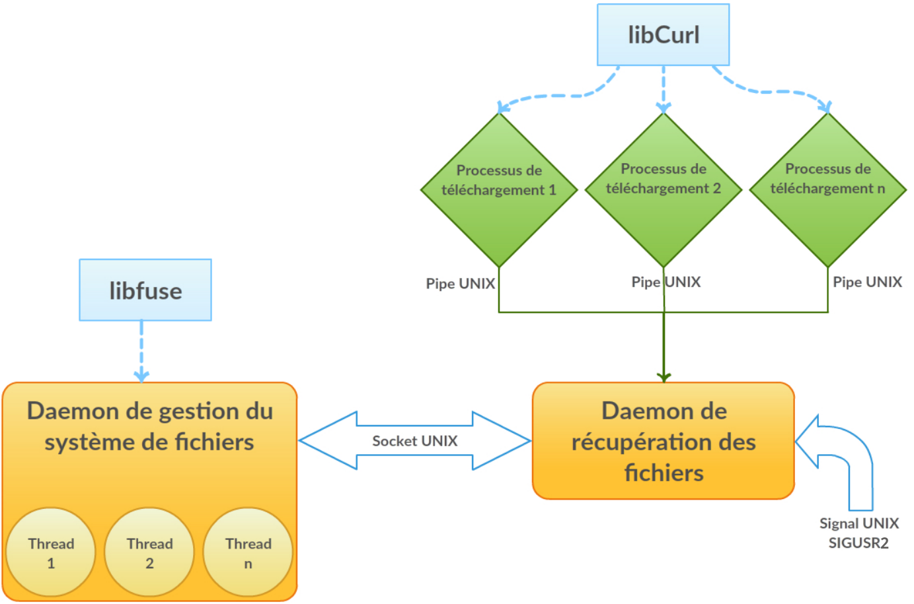
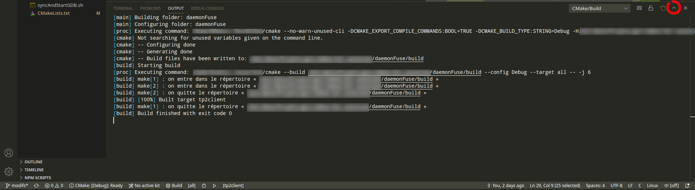
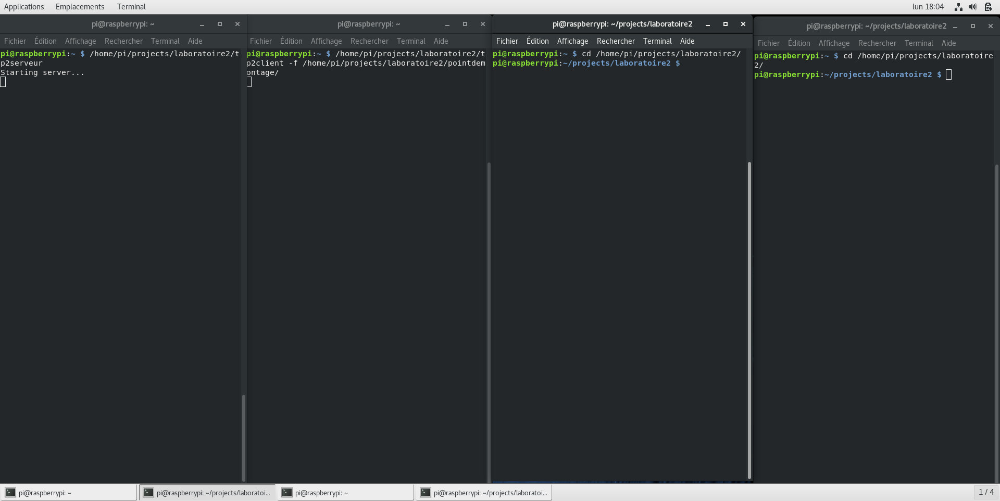

## 1. Objectifs

Ce travail pratique vise les objectifs suivants :

1. Se familiariser avec la norme POSIX, plus particulièrement l'utilisation des *processus*, des *pipes Unix*, du multithreading, des *sockets*, des *signaux* et du système de fichiers;
2. Se familiariser avec l'utilisation des pages de manuel Unix;
3. Concevoir et implémenter un projet de moyenne envergure dans un langage de bas niveau (C);
4. Comprendre la notions d'abstraction des fichiers sur Unix.

## 2. Présentation du projet

Dans ce projet, vous devrez implémenter **setrFS**, un système de fichiers en espace utilisateur. Plus spécifiquement, ce système de fichiers doit offrir une couche d'abstraction pour un serveur web (HTTP) : si le serveur contient les fichiers "a.txt", "b.cpp" et "c.jpg" dans la racine de son serveur HTTP, alors un `ls` à la racine de votre système de fichier doit présenter ces trois mêmes fichiers. Pareillement, ouvrir un de ces fichiers (par exemple en utilisant `cat`) doit, de manière transparente à l'utilisateur, télécharger le fichier et le livrer à l'utilisateur comme si c'était un fichier local.

Le projet doit être en mesure d'effectuer ses traitements en parallèle; autrement dit, si deux processus distincts ouvrent deux fichiers (différents ou non), votre système de fichier doit pouvoir les télécharger et les livrer en même temps. L'architecture générale du projet est présentée dans la figure suivante.

Conceptuellement, le projet consiste en deux programmes roulant en tant que *daemon* sur le Raspberry Pi. Le premier est un serveur de téléchargement : il offre une interface sur un socket Unix qui permet à n'importe quel autre processus de demander le téléchargement d'un fichier situé sur une machine distante. Comme le téléchargement d'un fichier peut potentiellement être long, ce serveur recourt à du *multiprocessing*, c'est-à-dire que chaque requête est traitée par un processus différent. Cela permet une parallélisation intrinsèque des téléchargements.

Ce serveur possède une interface très simple. Afin de pouvoir réellement mettre en place un système de fichiers, il est nécessaire de fournir une implémentation plus formelle des différents appels systèmes (*open*, *read*, *stat*, etc.) utilisés pour explorer une arboresence et lire des fichiers. C'est la tâche du second programme, qui est un système de fichiers en espace utilisateur utilisant la librairie **fuse**.

Cette manière de découper le problème entre, d'une part, un programme capable d'effectuer des requêtes HTTP pour transférer localement un fichier, mais n'offrant qu'une interface limitée, et, d'autre part, un programme offrant une interface de système de fichiers complète, mais incapable de récupérer un fichier autrement que par une interface simple, confère une grande polyvalence à ce système. Par exemple, si l'on souhaitait plutôt avoir un système de fichiers offrant une couche d'abstraction à un serveur FTP, il suffit de remplacer le *daemon* de téléchargement, l'implémentation du *daemon* offrant le système de fichiers à proprement parler restant exactement la même.

## 3. Préparation et outils nécessaires

### 3.1. Prérequis logiciels et configuration du Raspberry Pi

**Attention** à ne pas mettre à jour le système (n'exécutez *pas* un apt-get upgrade)!

Les prérequis logiciels sont déjà installés pour vous, donc normalement il n'y a aucun changement à faire.

Pour information, les dépendances sont les suivantes :

* [cURL et libcurl](https://curl.haxx.se/libcurl/)
* [libFUSE](https://github.com/libfuse/libfuse) -- attention cependant à utiliser la version **2** et non la version 3
* fusermount

Ces librairies sont déjà installées dans le disque image du cours. Elles devraient aussi avoir été synchronisées avec votre chaîne de compilation croisée lors du laboratoire 1. Vous n'avez donc normalement rien à faire. Si ce n'est pas le cas, assurez vous de copier les fichiers objets (fichiers *.a* et *.so*) et en-têtes de ces librairies sur votre ordinateur en suivant la procédure du laboratoire 1.

### 3.2. Configuration des dossiers

Les scripts fournis assument que les répertoires suivants existent et qu'ils sont accessibles en écriture : `/home/pi/projects/laboratoire2` et `/home/pi/projects/laboratoire2/pointdemontage`

### 3.3. Récupération du code source

Afin de clarifier certains détails d'implémentation, nous vous fournissons une ébauche de code que vous devez utiliser. Les divers fichiers vous sont fournis dans un [dépôt Git](https://github.com/setr-ulaval/labo2-h21). Clonez ce dépôt sur votre ordinateur de développement et, une fois cet énoncé lu, *prenez le temps d'explorer les divers fichiers, qui contiennent beaucoup de commentaires quant aux tâches précises à effectuer.* Rappel : vous ne devriez *pas* avoir à cloner le dépôt contenant les fichiers sources sur le Raspberry Pi!

> **Note** : comme pour le laboratoire 1, vous **devez** modifier les fichiers `.vscode/launch.json` et `.vscode/tasks.json` pour y écrire l'adresse de votre Raspberry Pi, et ce *dans chacun des sous-dossiers*.

### 3.4. Organisation du code

Le code source est divisé en deux dossiers qui constituent deux projets VSC distincts, *serveurCurl* et *daemonFuse*. Chacun de ces projets peut être exécuté indépendamment. Comme pour le laboratoire 1, des CMakeLists.txt sont fournis, ce qui vous permet de les compiler en utilisant la commande `CMake Build`. Vous pouvez également les lancer en mode Debug. Faites attention à ne pas mélanger les fichiers des différents projets.

> **Note importante** : les librairies cURL et fuse possèdent des dépendances qui génèrent des instructions illégales au lancement du programme. Ce phénomène est normal, mais pour éviter qu'il ne vous empêche de déboguer vos programmes, assurez-vous d'ajouter *systématiquement* un point d'arrêt (breakpoint) au début de votre fonction `main()`.

## 4. Première partie : serveur de téléchargement

Pour cette première partie, vous devez implémenter un serveur de téléchargement. Ce serveur doit :

1. Ouvrir un *socket Unix* à un emplacement de votre choix (les sockets Unix sont matérialisés par des pseudo-fichiers).
2. Se mettre en écoute et attendre une connexion sur ce socket.
3. Lorsqu'une connexion est acceptée, recevoir une requête dont la forme est définie dans le fichier *communications.h* qui vous est fourni. Il y a deux types de requêtes possibles, soit une requête de lecture (où votre serveur doit retourner le fichier demandé sur le socket Unix) et une requête de listage des fichiers (dans ce dernier cas, votre serveur doit retourner le contenu du fichier spécial *index.txt*).
4. Pour effectuer la requête, votre serveur doit se scinder (*fork*) pour créer un *nouveau processus* qui s'occupera de la requête et permettra au parent de traiter immédiatement une nouvelle requête. Le processus parent de votre serveur doit pouvoir recevoir la réponse du processus enfant (le contenu du fichier) via un *pipe Unix*.
5. Une fois le processus enfant terminé, votre serveur doit envoyer le fichier téléchargé sur le socket Unix en attente de ce dernier.
6. À tout moment, votre processus serveur doit pouvoir accepter un signal de type *SIGUSR1* (qui peut par exemple être envoyé à partir d'une console avec `kill -s SIGUSR1 PID`, où *PID* est l'identifiant du processus serveur). Lorsque ce signal est reçu, le serveur doit immédiatement afficher dans la console des informations sur les connexions en cours, incluant au moins :
  * Le nombre de connexions actives;
  * Le nom des fichiers en cours de téléchargement;
  * L'identifiant des processus enfant s'occupant de chaque téléchargement.

Votre serveur doit pouvoir gérer au minimum cinq (5) connexions simultanées. Vous retrouverez dans le dossier *serveurCurl* du [dépôt Git du laboratoire](https://github.com/setr-ulaval/labo2-h21) l'architecture de ce programme ainsi que l'implémentation ou l'ébauche de certaines fonctions clés. Chaque fichier contient des commentaires précis sur la tâche que vous devez remplir, prenez le temps de les lire attentivement et de vous faire une vue d'ensemble avant de vous lancer dans la programmation à proprement parler. De manière détaillée, chaque fichier remplit le rôle suivant :

* **servermain.c** : contiennent la fonction *main()* du serveur de fichiers, ainsi que la fonction gérant les signaux. C'est dans la fonction *main* que se trouve la boucle de contrôle qui appelle les autres parties du serveur selon les besoins.
* **actions.h / actions.c** : déclarent et définissent trois fonctions qui sont utilisées dans la boucle principale du serveur. La première, *verifierNouvelleConnexion*, teste si un nouveau client a tenté de se connecter et, si c'est le cas, l'ajoute à la liste des connexions en cours. La seconde, *traiterConnexions*, détermine si une requête a eu lieu sur une de ces connexions actives. La dernière, *traiterTelechargements*, vérifie si un téléchargement est complété et envoie la réponse au client s'il y a lieu.
* **requete.h / requete.c** : contiennent des fonctions utilitaires pour la gestion des requêtes. Ces fonctions sont déjà implémentées pour vous, vous n'avez donc pas à y toucher; nous vous suggérons néanmoins de lire les commentaires de ces fichiers avec attention pour bien comprendre le fonctionnement des fonctions et structures de données qu'ils définissent.
* **telechargeur.h / telechargeur.c** : contient le code exécuté par les processus enfants, utilisant cURL pour récupérer le contenu d'un fichier distant. Les fonctions qu'ils contiennent sont déjà implémentées pour vous; toutefois, comme pour l'item précédent, nous vous conseillons fortement de lire les fichiers afin de bien comprendre ce qu'ils font et de visualiser comment les intégrer au reste du code. En particulier, le fichier d'en-tête explique comment sont gérées les erreurs, par exemple dans le cas d'une erreur 404 lors du téléchargement du fichier demandé. La constante *baseUrl* définie au début de *telechargeur.c* contient l'adresse du serveur de fichiers, que vous n'aurez normalement pas à modifier (même s'il ne vous est pas interdit de mettre en place votre propre serveur ayant les mêmes caractéristiques que celui du cours). 
* **communications.h / communications.c** : ces fichiers sont les seuls partagés avec le second programme et définissent un protocole de communication simple entre le client et le serveur.

> Notez que le débogueur GDB n'est pas, par défaut, capable de déboguer les processus enfants lancés avec *fork*. Ainsi, vous ne pourrez pas suivre ce qui se passe dans les processus enfants exécutant cURL. Ce n'est toutefois pas un problème dans le contexte de ce laboratoire, puisque le code (correct) de téléchargement vous est déjà fourni.

## 5. Seconde partie : système de fichier local

La structure d'un *daemon FUSE* est beaucoup plus contrainte que le serveur de téléchargement. Afin de simplifier votre tâche, nous mettons à votre disposition une ébauche de code (*daemonFuse/setrfs.c*) ainsi qu'un fichier d'outils (*daemonFuse/fstools.c*) implémentant diverses fonctions qui vous seront utiles lors du laboratoire. **Lisez ces fichiers avec attention avant de commencer à programmer, ils contiennent beaucoup d'informations utiles à l'implémentation du système de fichiers.**

De manière générale, l'écriture de ce *daemon* consiste à implémenter les différents appels système qui composent un système de fichier. Par exemple, la procédure d'ouverture et de lecture d'un fichier devrait être la suivante :

1. Un processus (peu importe lequel, ce peut être un utilitaire en ligne de commande comme `cat` par exemple) utilise l'appel système *open* pour ouvrir le fichier. C'est à ce moment que vous demandez le téléchargement du fichier au serveur de téléchargement. L'appel à *open* sera bloquant tant que le téléchargement ne sera pas complété, ce qui est permis par le standard POSIX. Une fois le fichier téléchargé et récupéré via le socket Unix, vous devez le stocker dans la mémoire du *daemon* FUSE pour permettre son accès rapide. Une structure de cache potentielle sous forme de liste chaînée vous est fournie, mais vous pouvez opter pour un autre mécanisme.
2. Le processus utilise *read* pour lire un certain nombre d'octets. Vous utilisez les données en cache pour fournir rapidement ces données au processus.
3. Le processus ferme le fichier en utilisant *close* (qui correspond à la fonction *release* avec FUSE). Vous pouvez alors libérer la mémoire utilisée pour stocker ce fichier en cache.

Notez que tous ces traitements s'effectuent de manière intrinsèquement parallèle. En effet, FUSE utilise un nouveau processus léger (*thread*) pour chaque appel système, ce qui signifie que plusieurs fichiers peuvent être ouverts simultanément, ou même que deux processus distincts peuvent ouvrir le même fichier (et donc partager le même cache). Assurez-vous donc de synchroniser vos accès au cache en utilisant le *mutex* déclaré dans les structures de données qui vous sont fournies et de ne supprimer une entrée du cache que lorsque *tous* les processus l'utilisant sont terminés. Pour vous aider au départ, les scripts de VSC sont configurés pour passer l'option `-s` à votre programme pour requérir un fonctionnement *single-threaded*, mais vous **devez** supporter le mode normal (multithread) pour l'évaluation. Pour tester ce cas, une fois votre programme débogué en mode *single-thread*, vous pouvez le lancer directement à partir d'un terminal SSH.

## 6. Outils

Afin de vous permettre de tester votre code, un serveur HTTP a été mis en place à l'adresse *http://wcours.gel.ulaval.ca/2020/h/GIF3004/default/labo2/*. Cette URL pointe vers un dossier contenant plusieurs fichiers de diverses tailles allant de 1 Ko à 100 Mo. La liste des fichiers est donnés dans le fichier *[index.txt](http://wcours.gel.ulaval.ca/2020/h/GIF3004/default/labo2/index.txt)*.

Le fichier *[md5sums.txt](http://wcours.gel.ulaval.ca/2020/h/GIF3004/default/labo2/md5sums.txt)* contient quant à lui la somme MD5 de chaque fichier du répertoire (sauf lui-même), pour faciliter la validation. Par exemple, si vous voulez vérifier que votre programme est en mesure de télécharger sans erreur le fichier *[file1Mo](http://wcours.gel.ulaval.ca/2020/h/GIF3004/default/labo2/file1Mo)*, utilisez simplement la commande `md5sum file1Mo`. Le résultat devrait être le même que celui contenu dans le fichier *[md5sums.txt](http://wcours.gel.ulaval.ca/2020/h/GIF3004/default/labo2/md5sums.txt)*; si ce n'est pas le cas, c'est qu'il y a une erreur dans votre programme et que vous n'êtes pas en mesure de restituer le fichier dans son intégrité.

N'oubliez pas que votre système de fichiers doit pouvoir gérer plusieurs requêtes simultanées. À titre d'exemple, télécharger le fichier *[file100Mo](http://wcours.gel.ulaval.ca/2020/h/GIF3004/default/labo2/file100Mo)* devrait demander plusieurs secondes vu la taille de ce dernier; vous devriez être en mesure d'afficher un autre petit fichier (comme *[fichier.cpp](http://wcours.gel.ulaval.ca/2020/h/GIF3004/default/labo2/fichier.cpp)* ou *[logo.png](http://wcours.gel.ulaval.ca/2020/h/GIF3004/default/labo2/logo.png)*) presque instantanément, sans devoir attendre la fin du téléchargement du gros fichier!

## 7. Précisions et limitations du projet

Afin de simplifier la tâche à effectuer, vous pouvez assumer que :

* Le système de fichiers n'est accessible qu'en lecture. Aucune opération d'écriture n'a à être implémentée.
* La mémoire RAM est de taille suffisante pour contenir _2s octets_ où _s_ est la taille totale des fichiers. En d'autres termes, vous pouvez supposer que la taille totale des fichiers chargés ne dépassera jamais la moitié de la mémoire.
* Le système de fichiers ne permet qu'un seul dossier, la racine. Il n'y a aucun autre dossier sur le serveur.
* Le système de fichiers ne gère pas les permissions. Toute valeur de permission permettant de lire ses fichiers est adéquate.
* La norme POSIX permet à l'appel système *open* de bloquer, **sauf** si le drapeau *O_NONBLOCK* est passé. Dans votre cas, vous pouvez ignorer ce drapeau malgré tout (c'est d'ailleurs le comportement par défaut de FUSE).
* L'URL de base du serveur distant peut être directement insérée dans le code source en tant que constante, de même que le chemin vers le fichier représentant le socket Unix utilisé.
* Tel que mentionné plus haut, vous pouvez assumer la présence d'un fichier *index.txt* dans le répertoire du serveur HTTP, qui contient la liste de tous les fichiers du répertoire, chaque fichier étant séparé par un retour à la ligne.

Le projet doit être implémenté **en C ou C++**. Le C étant le langage historique de Unix et utilisé dans la norme POSIX, son utilisation est recommandée, mais vous pouvez utiliser des éléments C++, qui peuvent se révéler utiles dans certains occasions, notamment pour les structures de données avancées. Aucune fonction ou structure de données fournie n'utilise de fonctionnalités du C++.

Pour tester votre système de fichiers, nous vous conseillons d'utiliser d'abord les outils en ligne de commande (ls, cp, cat, md5sum, etc.) plutôt qu'un explorateur de fichier graphique, la raison étant qu'un tel explorateur fait énormément d'appels au système de fichiers, ce qui rend le débogage plus délicat au départ. Toutefois, une fois le programme stabilisé, une telle application pourrait constituer un très bon test de robustesse! Ceci exige cependant l'installation d'un environnement graphique, ce qui n'est pas le cas avec l'image du cours pour le Raspberry Pi.

Un excellent outil pour déboguer votre système de fichier est le programme *strace*. Ce programme permet de tracer tous les appels système effectués par un processus, y compris, donc, ceux reliés à l'ouverture d'un fichier ou d'un dossier. S'il y a une erreur dans une de vos fonctions, il vous sera ainsi beaucoup plus simple de déterminer laquelle (plutôt que de simplement voir un processus bloqué).

Par défaut, le système de fichiers FUSE se lance à l'arrière-plan, c'est-à-dire qu'il se déconnecte du terminal courant. Si c'est, de manière générale, un comportement souhaitable, il est moins utile dans un contexte de débogage. Pour éviter cela, les scripts de VSC sont configurés de manière à le lancer avec l'option `-f`, ce qui le force à rester à l'avant plan. De même, FUSE requiert un *point de montage* (*mountpoint*) comme premier argument. Par défaut, celui-ci est un dossier nommé *pointdemontage* dans le même répertoire que l'exécutable. Ce point de montage peut cependant être n'importe quel dossier vide sur lequel vous avez les droits d'écriture. Si votre programme plante et que vous êtes incapable de le relancer, assurez-vous que ce point de montage est bien *démonté* en utilisant la commande `fusermount -u mon_point_de_montage` sur votre Raspberry Pi.

N'oubliez pas que le projet est constitué de *deux exécutables distincts*. Par conséquent, ceux-ci doivent être lancés ensemble pour que le système soit complètement fonctionnel. Vous pouvez pour cela utiliser deux ordinateurs, mais aussi ouvrir deux fenêtres de VSC : les deux exécutables étant dans des dossiers distincts, ils sont considérés comme des projets différents par VSC. Si vous avez terminé et débogué un des exécutables, vous pouvez également l'exécuter à distance via SSH et le laisser fonctionner en arrière-plan sur le Raspberry Pi.

### 7.1. Avertissements du compilateur

Comme dans le laboratoire 1, les scripts sont configurés de manière à activer le report des avertissements par le compilateur. De plus, le code fourni est exempt d'erreurs et d'avertissements. Vous devez vous assurer que **votre code compile sans erreur ET sans avertissement**.

> **Attention** : les avertissements ne sont affichés par GCC que lorsque vous compilez effectivement un fichier. Si vous ne le modifiez pas et relancez la compilation, ces avertissements « disparaîtront » puisque GCC ne tentera même pas de recompiler les fichiers fautifs. Assurez-vous donc de toujours nettoyer (`CMake Clean`) votre environnement de compilation avant de compiler pour retirer les avertissements.

## 8. Modalités d'évaluation

Ce travail doit être réalisé **en équipe de deux**, la charge de travail étant à répartir équitablement entre les deux membres de l'équipe. Aucun rapport n'est à remettre, mais vous devez soumettre votre code source et une vidéo de démonstration dans monPortail avant le **18 février 2021, 9h30**. Ensuite, lors de la séance de laboratoire du **19 février 2021**, les deux équipiers doivent être en mesure individuellement d'expliquer leur approche et de démontrer le bon fonctionnement de l'ensemble de la solution de l'équipe du laboratoire. Si vous ne pouvez pas vous y présenter, contactez l'équipe pédagogique du cours dans les plus brefs délais afin de convenir d'une date d'évaluation alternative. Ce travail compte pour **15%** de la note totale du cours.

La démonstration vidéo devrait comprendre les éléments suivants:
* Une première partie montrant la compilation du projet sous VSCode: attention à bien faire apparaître toute la sortie de compilation, onglet *OUTPUT* en bas de l'interface de VSCode (voir capture d'écran). À noter que vous pouvez agrandir complètement le terminal de sortie en appuyant sur l'icône de flèche repéré en rouge ci-dessous;
  

* Une seconde partie dans laquelle on vous demande d'ouvrir 4 terminaux côte à côte et d'exécuter des commandes dans un ordre précis, voir la capture d'écran ci-dessous pour l'agencement des terminaux.

Les terminaux seront numérotés ci-après 1 à 4 respectivement de gauche à droite, ils seront tous connectés en ssh à votre Raspberry Pi:
* **Terminal 1**: c'est celui qui exécutera le serveur, soit la commande `/home/pi/projects/laboratoire2/tp2serveur`;
* **Terminal 2**: il exécute et affiche la sortie du daemon, donc `/home/pi/projects/laboratoire2/tp2client -f /home/pi/projects/laboratoire2/pointdemontage`. Mais avant de lancer le daemon, identifiez et notez le PID du serveur à l'aide de la commande `ps ax | grep tp2serveur`, vous l'utiliserez pour envoyer un signal `SIGUSR1` au serveur par la suite;
* **Terminal 3**: ce terminal et le suivant simuleront deux utilisateurs, vous deverez exécuter les commandes listées ci-après dans l'ordre. **Attention**, deux commandes sont à lancer en simultané (ou plutôt rapidement l'une après l'autre) dans les terminaux 3 et 4, elles sont repérées par la mention **(simultané)**:
  * `cd /home/pi/projects/laboratoire2/pointdemontage`;
  * `ls`;
  * `cat fichier.cpp`;
  * `md5sum file100Mo` **(simultané)**.
* **Terminal 4**: deuxième utilisateur. **Attention**, deux commandes sont à lancer en simultané (ou plutôt rapidement l'une après l'autre) dans les terminaux 3 et 4, elles sont repérées par la mention **(simultané)**:
  * `cd /home/pi/projects/laboratoire2/pointdemontage`;
  * `md5sum logo.png & kill -s SIGUSR1 PID &` **(simultané)** -> bien montrer la sortie dans le terminal 1;
  * `cat existepas.txt`;
  * `md5sum file1Mo`.

Pour vous simplifier l'enregistrement de la vidéo, rappelez vous que l'appui sur la touche ↑ (*haut*) depuis le terminal permet d'afficher les commandes précédentes, vous pouvez donc lancer les commandes à l'avance et les lancer plus facilement ainsi. Aussi, *Ctrl+L* vous permet de nettoyer le terminal, c'est-à-dire effacer les sorties précédentes.

Le barême d'évaluation détaillé sera le suivant (laboratoire noté sur 20 points) :

* (2 pts) Le programme est en mesure de télécharger un fichier sur un serveur distant via la librairie cURL.
* (5 pts) La communication entre le module serveur (le programme téléchargeant les fichiers) et client (le système de fichiers FUSE) via un socket Unix est fonctionnelle dans les deux sens.
* (5 pts) Le système de fichiers setrFS est fonctionnel en lecture (en particulier, il est possible de lister les fichiers et d'ouvrir tous les fichiers présents dans le répertoire de test).
* (2 pts) Le système complet est en mesure de gérer plusieurs fichiers en même temps, tant du côté du module serveur (téléchargement parallèle de plusieurs fichiers) que du côté du module client (plusieurs appels au système de fichiers simultanés).
* (1 pts) L'envoi d'un signal SIGUSR1 au module serveur écrit correctement les statistiques courantes sur la console.
* (1 pts) Les erreurs éventuelles (fichier non existant, module serveur non démarré) sont correctement signalées.
* (2 pts) La compilation des deux exécutables ne génère aucun avertissement (*warning*) de la part du compilateur
* (2 pts) Les étudiants sont en mesure d'expliquer l'approche utilisée et de répondre aux questions concernant leur code.

## 9. Ressources et lectures connexes

* Les [pages de manuel (man) de Linux](http://man7.org/linux/man-pages/index.html). Ces pages sont également disponibles sur la plupart des ordinateurs utilisant Linux, en tapant la commande `man nom_de_la_commande`.
* Un [tutoriel détaillé](https://computing.llnl.gov/tutorials/pthreads/) sur les threads POSIX (*pthreads*).
* Une [page d'explication des principales fonctions de FUSE](https://www.cs.hmc.edu/~geoff/classes/hmc.cs135.201109/homework/fuse/fuse_doc.html) dans le cadre de l'implémentation d'un système de fichiers simple.
* Une [référence en ligne](http://www.cplusplus.com/reference/clibrary/) de la librairie standard du langage C.
* Un [tutoriel d'introduction sur strace](https://jorge.fbarr.net/2014/01/19/introduction-to-strace/).
